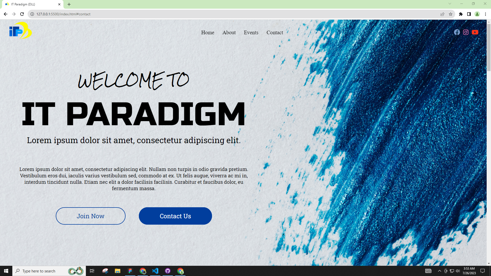

# IT PARADIGM LANDING PAGE
This was my entry for the Stage 2 of Programming Contest for IT Paradigm, a departmental organization at the Dalubhasaan ng Lungsod ng Lucena. This landing page showcase the IT Paradigm along with the topics and events you can expect them to hold every academic year.

**Wireframe Link**: [VIEW WIREFRAME!](https://www.figma.com/file/X5egNcrW1vsdQpOCaf95qU/IT-PARADIGM-(DLL)-Landing-Page?type=design&node-id=14%3A43&mode=design&t=fMM9pRmmc7ZlSAB3-1)

**Live Demo**: [VISIT HERE!](https://rovicbalingbing.github.io/itparadigm-landing-page/)

**Source Code**: [CLICK HERE!](https://github.com/rovicbalingbing/itparadigm-landing-page.git)

**Screenshot:**

